# **Capture the Flag : Semana 10**

## **Desafio 1**

### **Tarefas**

- **Explora a plataforma como um utilizador comum, faz um pedido e espera que este seja visto pelo administrador**

Após fazermos vários pedidos de forma a percebermos  melhor como funciona o website, concluímos que após fazermosum pedido temos de aguardar algum tempo. 

Após este tempo o website indica se o pedido que foi realizado teve sucesso ou não.

Exemplo de pedido sem sucesso:

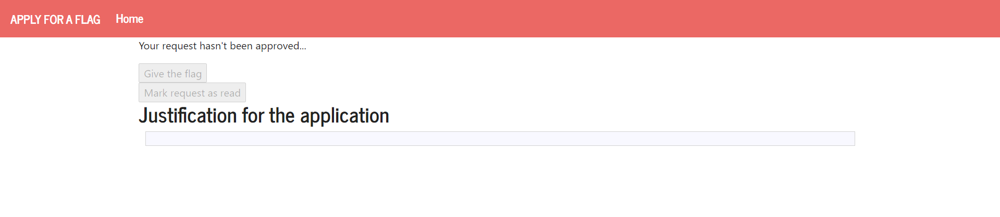

- **Verifica se existe alguma vulnerabilidade no formulário de submissão da justificação. Qual é? Consegues usá-la para que o teu pedido seja aprovado?**

Como não existe verificação de inputs no formulário de submissão da justificação, este formulário é então vulnerável.

Podemos dar exploit a esta variável introduzindo neste formullário um programa javascript que execute os comandos por nós implementados e nos permita obter a informação que pretendemos.

- **Cria uma exploit que explore esta vulnerabilidade e faça com que o teu pedido seja aprovado. Envia-a para o administrador**

De forma a conseguirmos explorar esta  vulnerabilidade introduzimos no formulário o seguinte input:

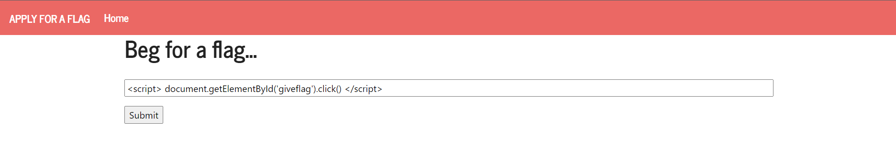

Após esperarmos algum tempo, foi nos enviada pelo servidor a flag que pretendíamos obter:

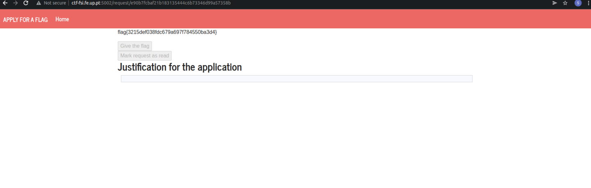

## **Desafio 2**

### **Tarefas**

- **Deves começar por correr o checksec e analisar quais são as suas proteções e que tipo de ataques é possível fazer.**

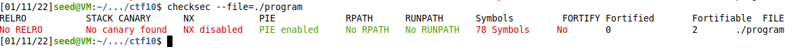

Como podemos verificar após correr o checksec, não tem canários, logo não existe proteção contra ataques provenientes de buffer overflows.

- **De seguida, deves analisar o código-fonte e responder às seguinte questões:**

    - Qual é a linha do código onde a vulnerabilidade se encontra?
        
        A vulnerabilidade enccontra-se na linha 12 na chamada à função gets.

    - O que é que a vulnerabilidade permite fazer?

        Esta vulnerabilidade permite realizar um buffer overflow e por consequência injetar código arbitrário na stack.

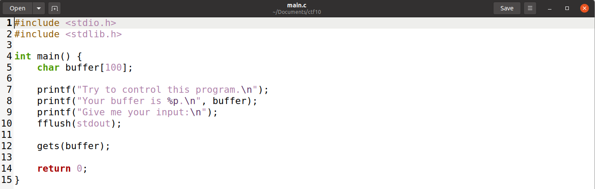

- **Cria uma exploit que te permita chamar uma shell no servidor de forma a obter a flag que se encontra no working directory do programa.**

**Análise da stack:**

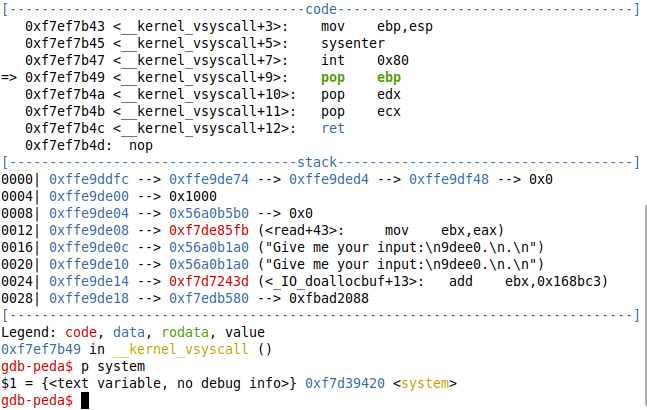

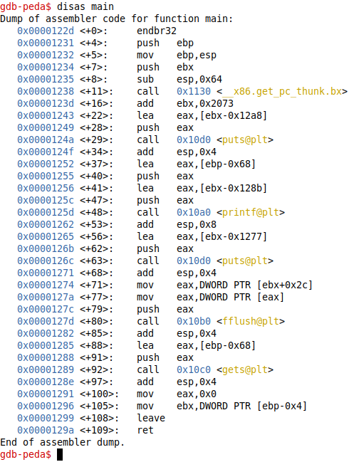

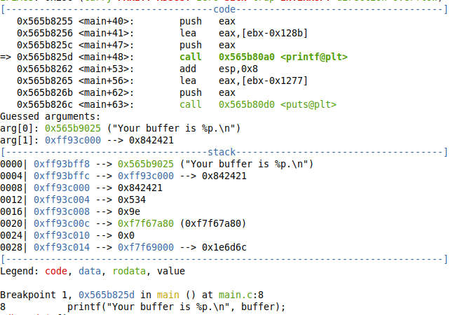

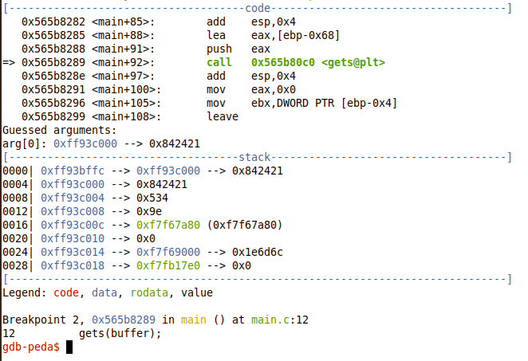

Após termos analisado a stack criamos o seguinte exploit que executa shellcode para abrir uma shell.

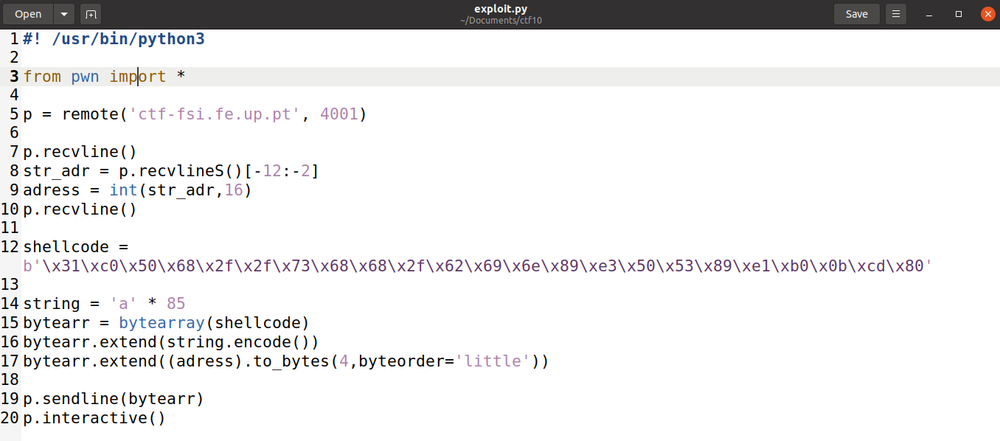

A execução do exploit revelou-nos a flag que pretendíamos obter, tendo sido assim realizado o ataque com sucesso.

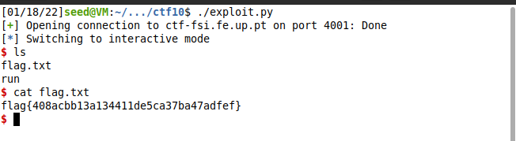

