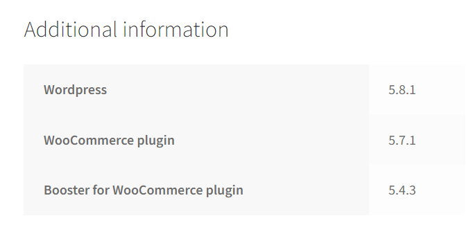
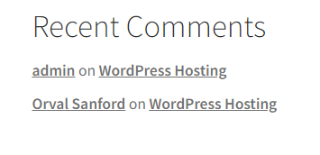
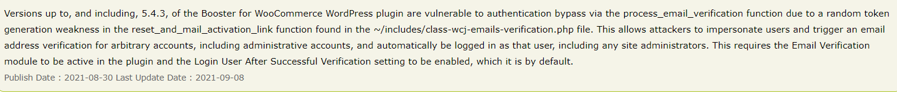
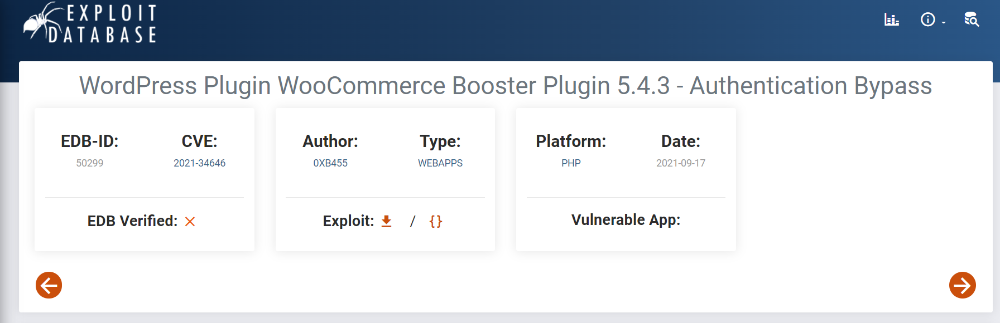
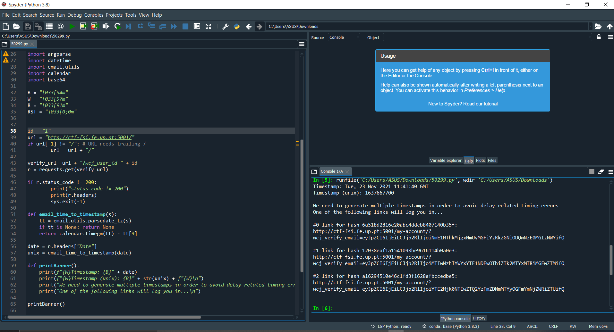
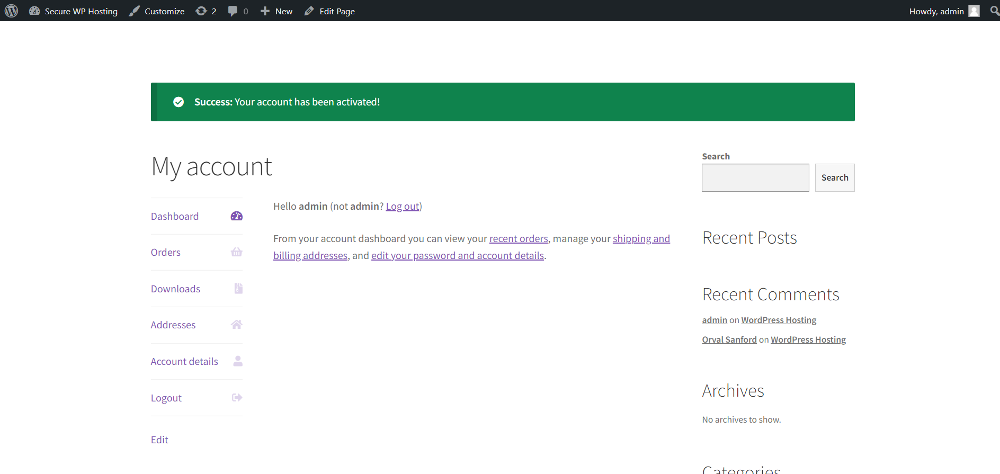
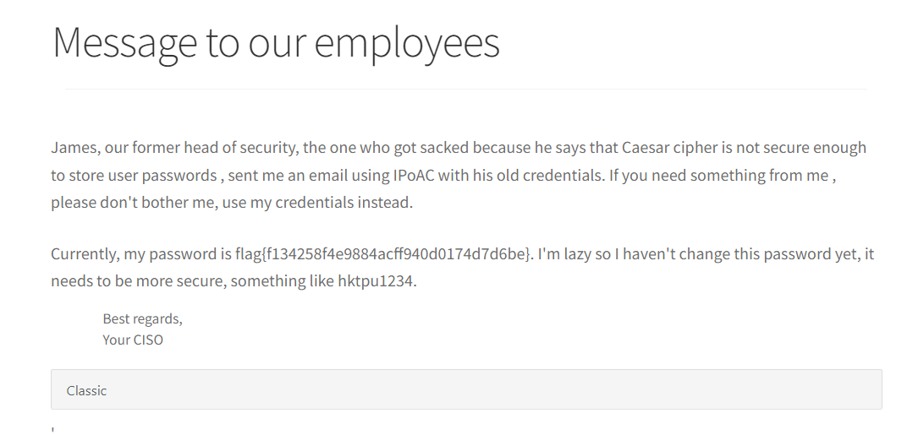

# **Capture the Flag : Semana 4**

## **Matéria Relacionada**

Common Vulnerabilities and Exposures (CVE)

## **Objetivo**

Fazer login como administrador num servidor wordpress utilizando uma CVE com exploit conhecido.

## **Desafio** 

Encontrar e perceber como funciona um CVE que esteja associado a um website. Entender a sua importância para a partilha de conhecimento em segurança informática e como é que podem ser utilizados para atacar sistemas.

## **Tarefas**

## Reconhecimento

Ao navegarmos através de todas as funcionalidades do website conseguimos adquirir bastante informação que consideramos ser pertinente no que toca à pesquisa de uma vulnerabilidade associada ao website, e aos possíveis ataques relacionados com a mesma.

Assim conseguimos obter as diferentes versões de plugins instalados e as suas versões correspondentes:

A versão do Wordpress utilizada:

E por fim o nome de um utilizador:

## Vulnerabilidades 

Após a descoberta dos plugins instalados e da sua correspondente versão procedemos à pesquisa de vulnerabilidades que estivessem associadas a estas mesmas versões e que de certa forma nos permitissem cumprir o desafio que nos foi anteriormente proposto (de conseguir realizar o login como administrador).

Após alguma pesquisa nas bases de dados de vulnerabilidades conhecidas conseguimos encontrar várias que estavam associadas aos plugins instalados no website, porém apenas uma nos permitia atingir o objetivo proposto.

A vulnerabilidade que escolhemos está relacionada com o plugin Booster for WooCommerce, mais propriamente da versão 5.4.3 e escolhemos esta pois como está explicado na descrição da mesma, esta versão do plugin está vulnerável a bypass de autenticação que permitia ao atacante "fingir" que era um certo user e automaticamente dar login como esse user (incluíndo admninistradores).

Depois, procuramos um exploit que estivesse relacionado com esta vulnerabilidade e encontramos o seguinte exploit disponibilizado na internet:

Após explorar este exploit, utilizamos o código disponibilizado que nos permitu obter um link de acesso de um User à nossa escolha. 

Com um dos links conseguimos então realizar o acesso ao website com a conta de administrador:

Agora que tínhamos todas as permissões conseguimos aceder a conteúdo priveligiado e terminar o ataque com sucesso.

