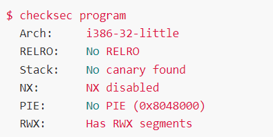
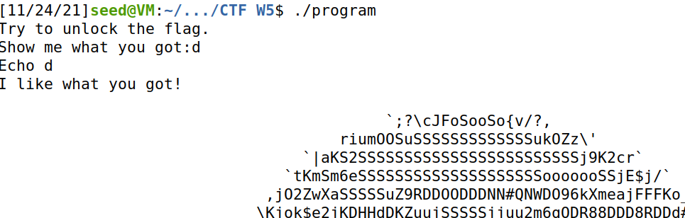
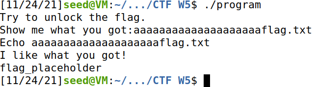
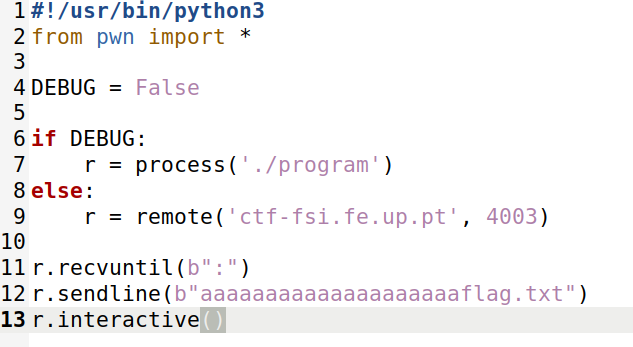
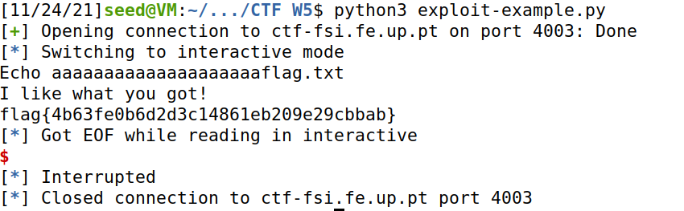
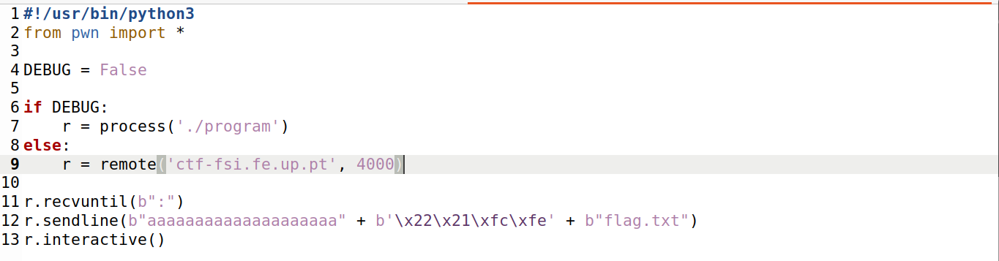
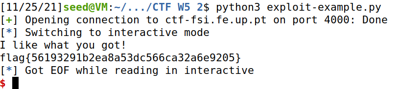

# **Capture the Flag : Semana 5**

## **Matéria Relacionada**

Usurpação de controlo por buffer overflow

## **Objetivo**

Explorar o funcionamento da stack e buffer-overflows

## **Desafio** 

Nesta semana são propostos dois desafios com níveis de dificuldade diferentes. Os desafios terão como objetivo a exploração de vulnerabilidades de buffer overflow. 

## **Desafio 1**

A flag encontra-se num ficheiro chamado flag.txt, no working directory. O objetivo é de alguma forma ler este ficheiro tomando controlo das funcionalidades do programa que se encontra a correr.

Analisarmo as proteções com que o programa é compilado:

Concluímos que a arquitetura do ficheiro é x86 (Arch), não existe um cannary a proteger o return address (Stack), a stack tem permisssão de execução (NX), e as posições do binário não estão randomizadas (PIE) e por fim existem regiões de memória com permissões de leitura, escrita e execução (RWX), neste caso referindo-se à stack.

## **Questões**
    
- **Existe algum ficheiro que é aberto e lido pelo programa?**

Na execução do programa, é aberto e lido um ficheiro de texto com o nome "mem.txt"

        

- **Existe alguma forma de controlar o ficheiro que é aberto?**

Sim é possível porque existe uma variável "meme_file" que guarda o nome do ficheiro que é suposto ser aberto.

- **Existe algum buffer-overflow? Se sim, o que é que podes fazer?**

Existe um overflow do buffer na chamada à função scanf, sendo possível aceder à memória que está alocada fora do buffer.

## **Ataque**

Testamos o programa localmente, provocamos um over-flow do buffer e conseguimos abrir o ficheiro "flag.txt" sem alterar o source code.

Alteramos o exploit de forma a que recebesse de input a string "aaaaaaaaaaaaaaaaaaaaflag.txt" para provocar o overflow do buffer

Por fim, corremos o exploit e conseguimos obter a flag que se encontrava escondida no ficheiro "flag.txt"

## **Desafio 2**

## **Questões**

- **Que alterações foram feitas?** 

Foi acrescentado um array "val" entre os arrays "buffer" e "meme_file" para tentar combater a vulnerabilidade associada ao buffer overflow, sendo o array "val" verificado no source code.

- **Mitigam na totalidade o problema?**

Não, apenas tornam o acesso mais complicado, visto que a origem do problema (função scanf()) não foi removida.

- **É possivel ultrapassar a mitigação usando uma técnica similar à que foi utilizada anteriormente?**

Sim, primeiro é necessário saber os valores que o programa espera que o array "val" tenha e em seguida introduzir no "val", através do overflow no buffer, os bytes necessários para que o programa passe no teste de verificação deste array.

## **Ataque**

Após verificar o source code e ver quais são os bytes que o programa espera que o array "val" tenha, foi possível deduzir um input que, através do overflow do buffer, permitiu dar overwrite ao array "meme_file", escrevendo "flag.txt" e descobrir o conteúdo deste.

O input que permitiu efetuar o ataque com sucesso foi (syntax de Python):
b"aaaaaaaaaaaaaaaaaaaa" + b'\x22\x21\xfc\xfe' + b"flag.txt"

