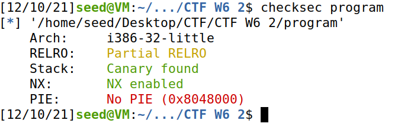

# **Capture the Flag : Semana 6**

## **Matéria Relacionada**

Usurpação de controlo usando format string vulnerabilities.

## **Objetivo**

Explorar format string vulnerabilities

## **Desafio 1**

É fornecido um ficheiro ZIP com um executável (program) e o código fonte (main.c). O desafio é encontrar a flag que se encontra no ficheiro flag.txt que é lido pelo programa. 

### **Tarefas**

Existe RELR0 parcial que força o GOT (Global Offset Table) a vir antes de BSS (secção usada pelo compilador para variáveis globais e static) na memória eliminando o risco de existirem buffer overflows numa variável global que dê overwrite a GOT.

O overwrite de GOT é uma técnica de exploit binário onde o endereço GOT de uma função é substituído por um endereço de uma função desejada pelo atacante.

Os stack cannaries existem e são um valor secreto colocado na stack que mudar sempre que o programa é iniciado. Antes do return da função, o stack cannary é verificado e se estiver modificado, o programa fecha imediatamente.

Os stack cannaries são uma maneira de mitigar qualquer stack smashing que possa acontecer pois é quase impossível adivinhar um valor random de 64-bits. Porém existem duas maneira de dar a volta a esta proteção, quer seja através de leaking do endereço ou bruteforce do cannary

A proteção de NX está ativa neste caso. Este método consiste na existência de zonas especificas de instruções e de informação. Qualquer acrescento que tentemos fazer é guardado como informação. Se tentamos correr esse código como instruções crasha o programa, bloqueando este tipo de acessos. Para dar a volta a este problema, são usados frequentemente ataques ROP(Return-Oriented Programming).

Como a proteção PIE está desativada, o ficheiro é carregado sempre na mesma posição de memória, sendo possivel aceder a essa localização facilmente. Se estivesse ativa, cada vez que era carregado, iria para um sitio diferente, não sendo possivel aceder a esse endereço sem saber a sua posição. Porém, isto poderia ser ultrapassado com recurso à leitura de valores a partir da stack.

### **Questões**

- **Qual é a linha do código onde a vulnerabilidade se encontra?** 

A vulnerabilidade encontra-se na linha 27 do código em "printf( buffer );".

- **O que é que a vulnerabilidade permite fazer?**

Como não são utilizadas format strings no printf, é permitido ao atacante o controlo do formato do output, o que lhe permite aceder ao seu conteúdo de diversas maneiras.

- **Qual é a funcionalidade que te permite obter a flag?**

Para desbloquearmos a funcionalidade temos que, após o endereço da variável "flag", passá-lo como input do programa seguido do string format "%s" que acede à variável guarda nesse endereço e coloca na consola o seu conteúdo, mais especificamente a flag que pretendemos obter.

## **Desafio 2**

### **Tarefas**

### **Questões**

- **Qual é a linha do código onde a vulnerabilidade se encontra? E o que é que a vulnerabilidade permite fazer?**

A vulnerabilidade encontra-se na linha 14 do código em "printf(buffer);", tal como no desafio anterior.

- **A flag é carregada para memória? Ou existe alguma funcionalidade que podemos utilizar para ter acesso à mesma.**

Em nenhum ponto do código o ficheiro "flag.txt" é lido e a flag colocada em memória, porém se a variável key for equivalente a "0xbeef" é executada a system call "system("/bin/bash")" que nos permite ter acesso à consola em modo interativo, e consequentemente executar o comando "cat flag.txt", obtendo assim a flag.

- **Para desbloqueares essa funcionalidade o que é que tens de fazer?**

Neste desafio temos o obstáculo acrescido da presença de um canário. Para desbloquearmos a funcionalidade temos de passar o valor correspondente ao mesmo ("0xbeef") através da formatação de strings, ou seja, passando como input o endereço onde está guardada a variável "key" e através do string format '%n' inserir nela o valor "beef".

