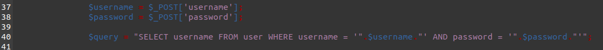
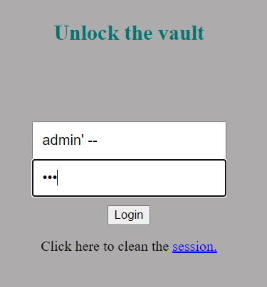
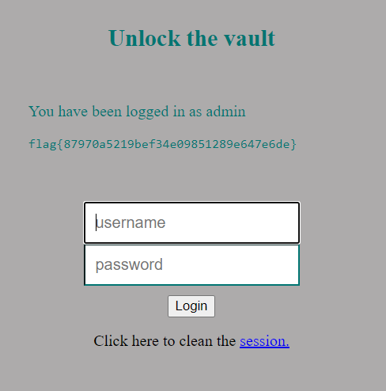
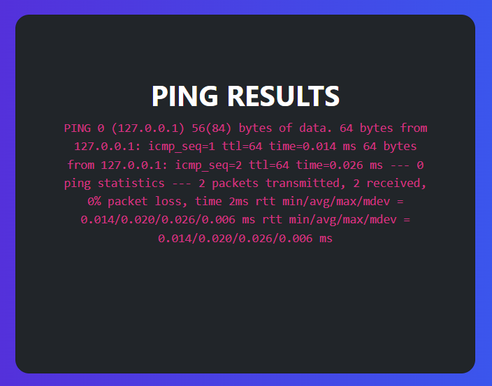
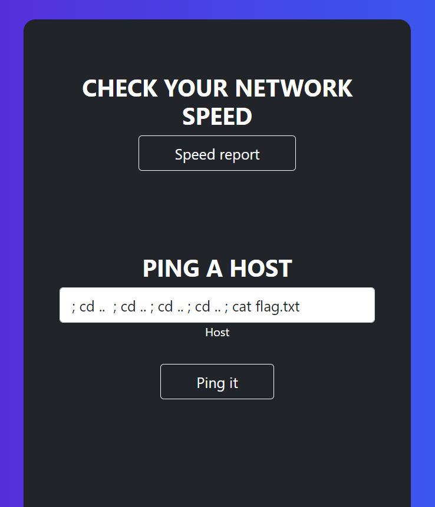
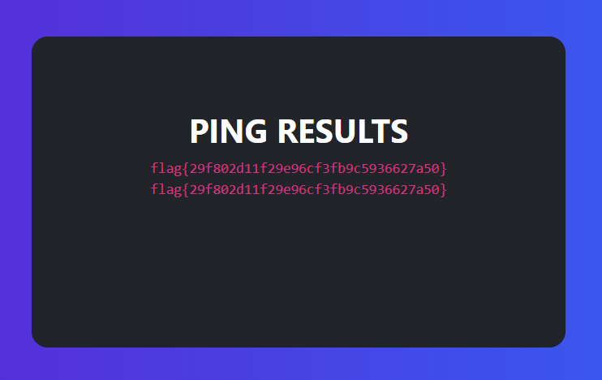

# **Capture the Flag : Semana 8**

## **Matéria Relacionada**

Segurança web, injeção de comandos.

## **Objetivo**

Explorar vulnerabilidades de injeção.

## **Desafio 1**

### **Tarefas**

Após análise do source code pudemos concluir que a vulnerabilidade se encontra entre as linhas 37 e 40 pois o input não é propriamente verificado.

Como o input de username não é verificado corretamente é possível atacar o sistema com recursos a SQL injection.

Assim sendo, de forma a conseguirmos dar bypass à autenticação de credenciais, inserimos o username do admin ("admin") seguido da string "' --" onde o caratér " ' " fecha a string e os caratéres "--" comentam o resto da query relativa à verificação da password, deixando de fazer diferença o input inserido como password.

Após inserimos o input apresentado em cima, conseguimos corretamente realizar o login como "admin" e consequentemente obter a flag necessária.

## **Desafio 2**

### **Tarefas**

- **Que funcionalidades é que estão acessiveis a um utilizador sem este estar autenticado?**

Inicialmente a página oferece ao utilizador a possibilidade de se autenticar submetendo as suas credenciais. Em baixo, porém, há outra opção que nos redireciona para uma página sobre o estado da ligação. Aqui, podemos optar por um botão que nos leva a um gif sobre a velocidade da conecção, ou por dar ping a um host através de mais uma submissão.

- **Das funcionalidade que identificaste e do feedback que tiveste da sua utilização, pensa como é que estas podem estar implementatadas no servidor. Será que estão a utilizar algum utilitário linux?**

Tendo em conta a necessidade de procura na base de dados quando submetemos dados para um campo de input, o login deverá ter implementado uma query para pesquisa dos valores, porém, tem guardas que impedem a injeção direta de Sql. No caso do ping, é feito recurso ao utilitário ping do linux que envia pacotes para outro host a verificar se a ligação está funcional, como podemos verificar ao receber a informação do comando.

- **Se sim, que vulnerabilidades podem estar presentes na chamada deste utilitário?**

Ao executarmos o comando sem restrições, abrimos a possibilidade para a chamada a outros utilitários quaisquer, através do carater ';', o que nos permite saber todo o tipo de informações e executar os mais variados comandos.

- **Verifica se existe alguma vulnerabilidade nesta funcionalidade.**

Esta vulnerabilidade está de facto presente, pois podemos aliar à chamada do comando ping para um determinado host a chamada de mais funções.

- **Identificada a vulnerabilidade, utiliza-a para aceder à flag que se encontra no ficheiro /flag.txt.**

Após descobrir a vulerabilidade, o único obstáculo torna-se a procura da flag. Com os comandos 'cd' e 'ls' conseguimos navegar nos diretórios anteriores e ver os seus conteúdos. Assim, após alguma pesquisa, encontramos o dito ficheiro e conseguimos aceder à sua informação.

