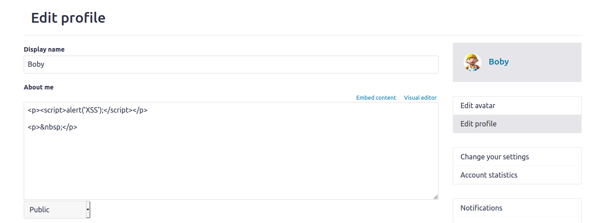
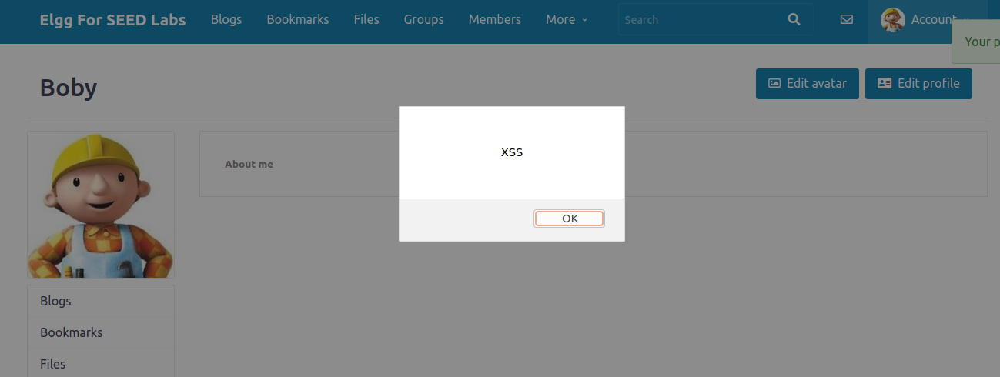
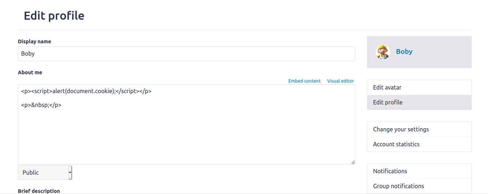
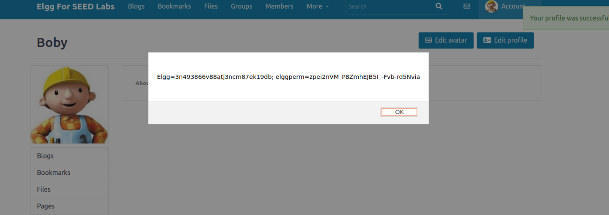
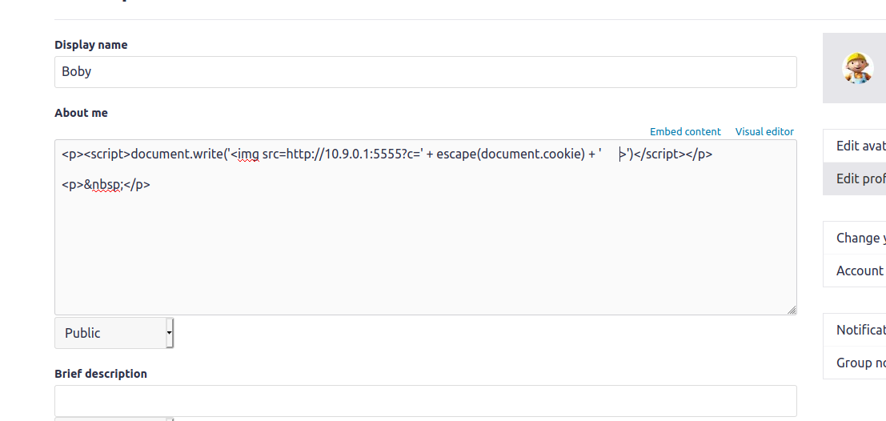
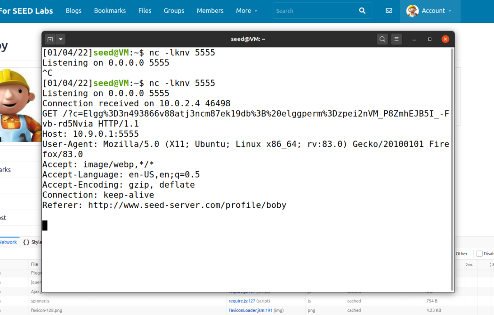
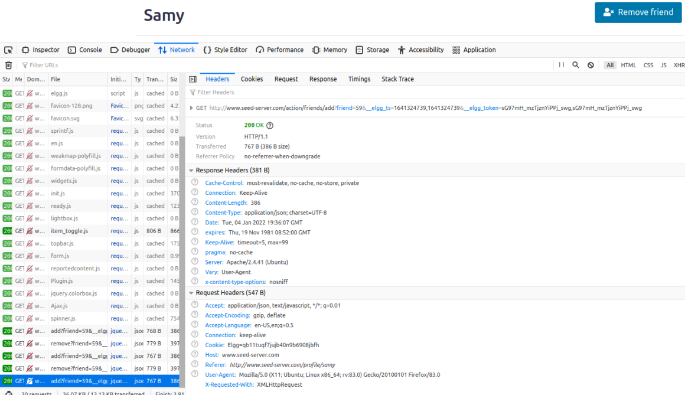
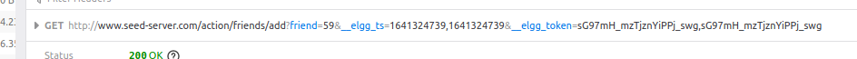
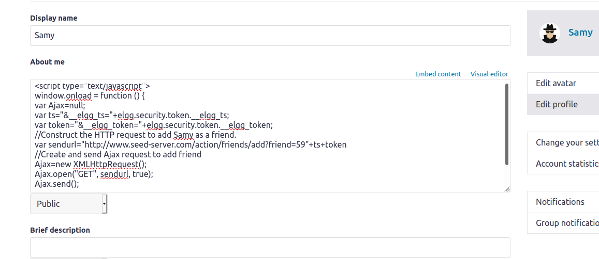
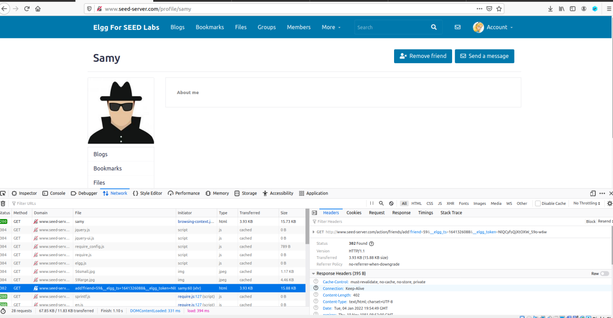

# **Trabalho realizado na Semana #10**


## **Getting Familiar with the "HTTP Header Live" tool**


De modo a dar setup ao lab corretamente, tomamos algumas medidas na preparação.
O primeiro passo foi mapear os nomes do servidor ao endereço de ip.
Após isto, corremos os comandos do docker para montar os containers.. Este lab tem por base a aplicação Web Elgg.


### **Task 1: Posting a Malicious Message to Display an Alert Window**

O objetivo da primeira tarefa é embutir um programa JavaScript no perfil da aplicação Web. Cada vez que o perfil é acedido uma janela de alerta aparece ao utilizador. Mal a página é carregada após a submissão, o código que escrevemos, agora guardado, é pura e simplesmente executado.

Ao submeter o script no campo de 'About Me' 



Resultado do ataque (alerta proveniente do input fornecido):



### **Task 2: Posting a Malicious Message to Display Cookies**

Nesta task, no perfil do Boby alteramos o código anterior para o código a seguir apresentado, e, novamente, após submetermos as mudanças pudemos observar que apareceu um pop up de um alerta que mostrava a cookie da sessão atual.



Resultado do ataque (alerta proveniente do input fornecido):



### **Task 3: Stealing Cookies from the Victim’s Machine**

Tal como nas tarefas anteriores, para roubar as cookies da vitima do ataque submetemos o código que queremos correr no campo do perfil. Porém, desta vez, é pretendido que as cookies nos sejam enviadas. Assim, efetuamos um pedido http, que é feito quando o browser tenta carregar uma imagem de um sitio que nós como atacantes definimos para receber as cookies. Nessa porta, se colocarmos um server TCP pronto a buscar o nosso pedido de cookies.


Resultado do ataque (Cookies recebidas usando o programa netcat):




### **Task 4: Becoming the Victim’s Friend**


De modo a criar um pedido que tornará o Samy em amigo da Alice, tivemos de perceber como é que funciona o pedido 'add friend'. 

Assim primeiro entramos num perfil diferente e adicionamos o Samy como amigo de modo a descobrir quais são os parâmetros do pedido http 'add friend' .






Após descobrirmos o ID associado ao Samy e sabendo já como funciona o pedido http 'add friend' podemos criar um pedido usando código JS que adiciona o Samy como amigo sempre que alguém entra no seu perfil. 

Este pedido tem o mesmo efeito de 'add friend' como o que foi feito antes para conhecermos os parâmetros do pedido http.

Assim o website deve  enviar um pedido GET com o URL apresentado em baixo na variable sendurl.

```html

<script>
    window.onload = function () {
    var Ajax=null;
    var ts="&__elgg_ts="+elgg.security.token.__elgg_ts;
    var token="&__elgg_token="+elgg.security.token.__elgg_token;
    //Construct the HTTP request to add Samy as a friend.
    var sendurl="http://www.seed-server.com/action/friends/add?friend=59"+ts+token
    //Create and send Ajax request to add friend
    Ajax=new XMLHttpRequest();
    Ajax.open("GET", sendurl, true);
    Ajax.send();
}
</script>

```



Resultado do ataque:





### **Question 1: Explain the purpose of Lines ➀ and ➁, why are they are needed?**

De modo a conseguirmos executar um pedido Http bem sucedido temos de concatenar ao request o token secreto e o timestamp do website pois, de outra maneira, o pedido não seria considerado legítimo, sendo considerado como um pedido cross-site não confiável e levando ao aparecimento de um erro (ataque falhado).

Estes valores que têm de ser concatenados estão guardados em variáveis JS e  podem ser acessado através das linhas 1 e 2.


### **Question 2: If the Elgg application only provide the Editor mode for the "About Me" field, i.e., you cannot switch to the Text mode, can you still launch a successful attack?**

Se não conseguissemos mudar para Text mode então o ataque executado já não seria possível porque o modo Editor codifica caractéres especiais que sejam apresentados no input.

Como precisamos de utilizar <script></script> para executar código JS, já não seria possível fazê-lo pois os caractéres seriam codificados para data.
