# **Trabalho realizado na Semana #11**

## **Task 1: Becoming a Certificate Authority (CA)**  

De modo a ter acesso à posse de uma public key, precisamos de nos tornar numa root CA, e, assim, ser uma entidade confiável, podendo gerar um certificado. De modo geral, este tipo de certificados são pré-carregados nos sistemas operativos, browsers, etc. Quando são gerados por root CA's são lhes dada total confiança. 

Inicialmente fazemos a configuração do ficheiro que nos permite usar o OpenSSL para gerar certificados. De seguida, geramos então o nosso certificado, submetendo as informações necessárias do "dono" e correndo o seguinte comando. 

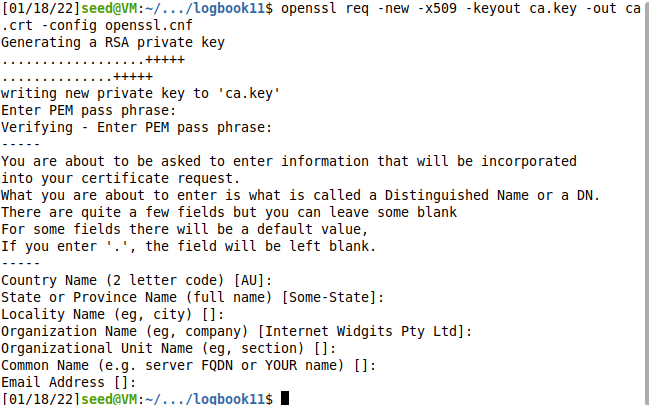


### **Question 1: What part of the certificate indicates this is a CA’s certificate?**

Podemos comprovar que o certificado se trata de um certificado CA pois a variável se encontra a True.

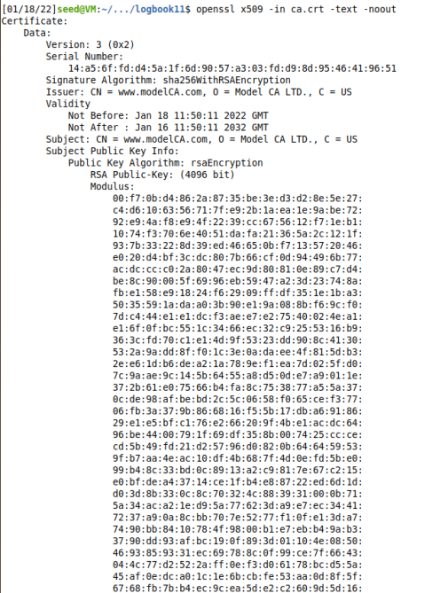


### **Question 2: What part of the certificate indicates this is a self-signed certificate?**

Analisando o certificado, podemos também concluir que o certificado é self-signed pois o  __Subject Key Identifier__ e o __Authority Key Identifier__ são iguais.

### **In the RSA algorithm, we have a public exponent e, a private exponent d, a modulus n, and two secret numbers p and q, such that n = pq. Please identify the values for these elements in your certificate and key files.**

Podemos confirmar que é possível visualizar o public exponent (65537) tanto no ficheiro do certificado como na chave. 

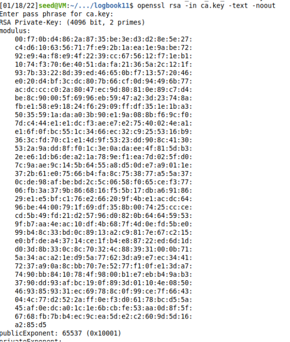


Por outro lado, os valores dos expoentes privados e dos números p e q apenas se encontram no ficheiro  da chave.

## **Task 2: Generating a Certificate Request for Your Web Server**   

Após este processo, o próximo passo é criar um CSR associado ao servidor em si. É então gerado um par de chaves pública e privada e o CSR gerado da primeira.

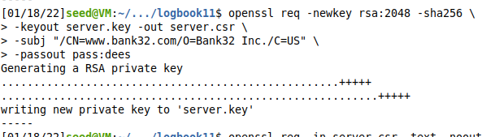

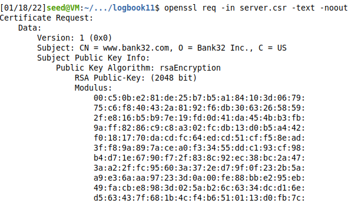

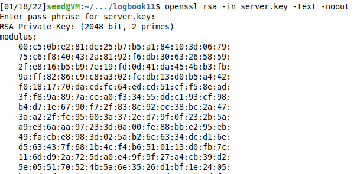

Devido à possibilidade dos websites terem múltiplos endereços e para podermos dar essa possibilidade à nossa CSR, adicionamos vários hostnames com o uso do campo "subjectAltName".

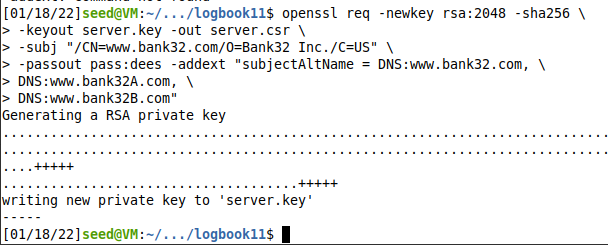


## **Task 3: Generating a Certificate for your server**

Nesta etapa, chega a altura de juntar o que foi feito anteriormente, usando a CA para gerar o CSR para o servidor.

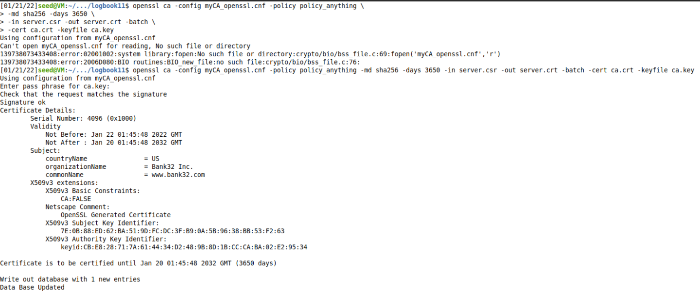

De modo a facilitar o acesso, definimos uma politica mais liberal, fazendo com que alguma da informação não tenha de bater com o certificado.

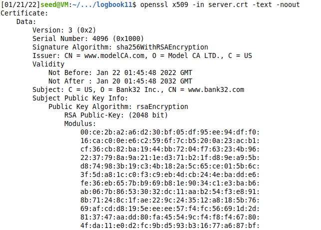


## **Task 4: Deploying Certificate in an Apache-Based HTTPS Website**   

Após todas as operações com os certificados, o objetivo agora passa por usar na prática, com o nosso servidor Apache. Para configurar o site HTTPS e respetivos hosts editamos então o ficheiro do VirtualHost no nosso container.

```<VirtualHost *:443>
    DocumentRoot /var/www/siteweb
    ServerName www.siteweb.com
    ServerAlias www.sitewebA.com
    ServerAlias www.sitewebB.com
    DirectoryIndex /siteweb/index.html
    SSLEngine On
    SSLCertificateFile    /certs/server.crt
    SSLCertificateKeyFile /certs/server.key
</VirtualHost>

<VirtualHost *:80>
    DocumentRoot /var/www/siteweb
    ServerName www.siteweb.com
    DirectoryIndex index_red.html
</VirtualHost>
```
De seguida, corremos os comandos  *dockps* e *docksh* para conseguirmos abrir uma shell no docker correspondente à pasta onde corremos os comandos *dcbuild* e *dcup*.

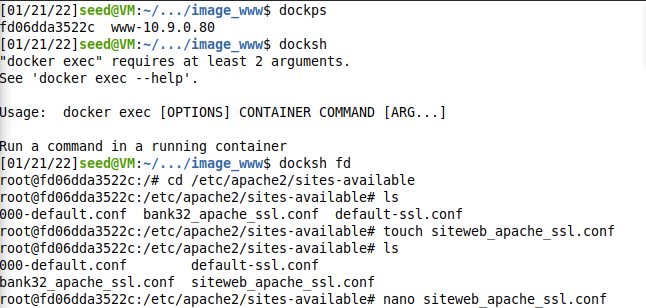

Agora precisamos de ativar o módulo do Apache (ssl) com os seguintes comandos:

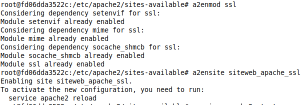

Após todos estes procedimentos e de forma a corretamento criar o nosso site corremos o comando apresentado em baixo:

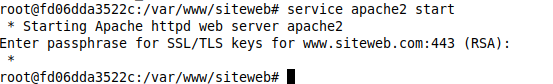


Resultando no seguinte website:

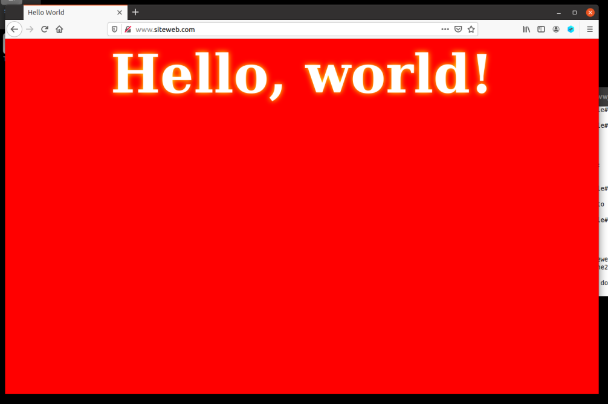

Porém se tentarmos correr o site acrescentando ao seu URL https no início somos apresentados com o seguinte erro:

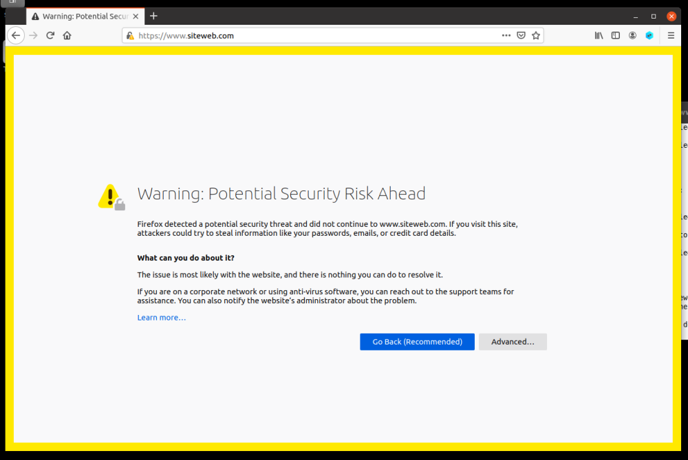

Isto acontece pois o certificado do site que criamos não foi ainda aprovado e aceite pelo Firefox. Assim temos de o inserir manualmente.

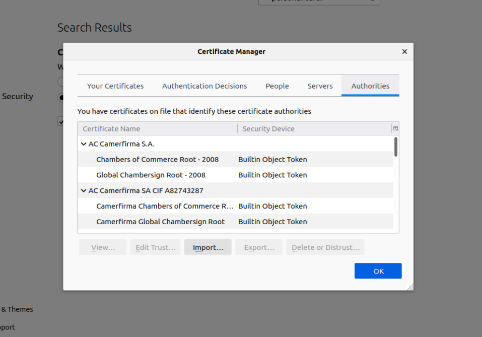

Após o inserimos, pudemos então verificar que já conseguimos ter acesso acrescentando https ao início do URL.

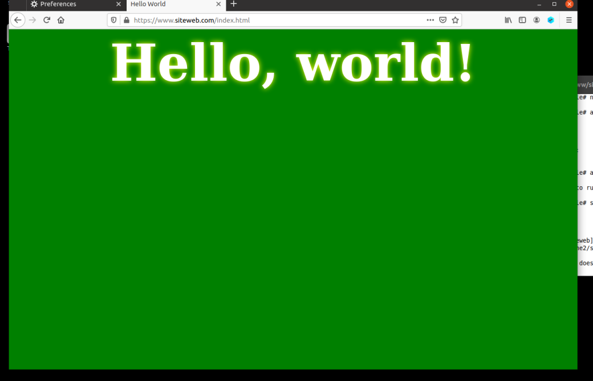


## **Task 5: Launching a Man-In-The-Middle Attack**   

Para configurarmos o site malicioso e realizarmos o ataque MITM, voltamos a recorrer ao método da tarefa anterior e adicionamos uma entrada no SSL do Apache, apenas alterando o servidor alvo.

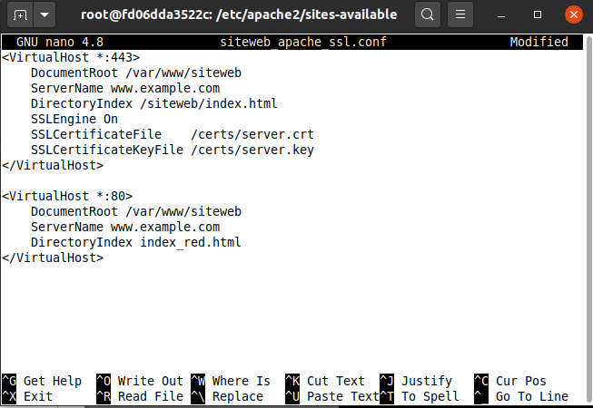

Com vista a atuar como man in the middle, optamos por modificar o */etc/hosts* para mapear o hostname requerido para o nosso site malicioso.

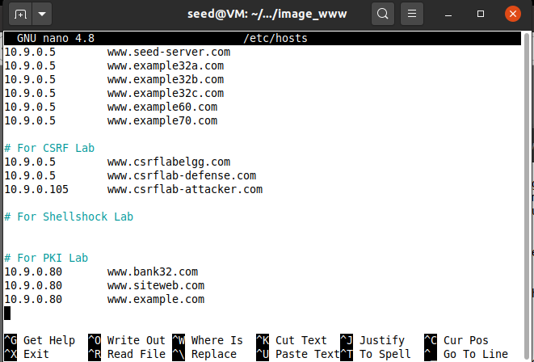

Resultando no seguinte:


Este aviso ée apresentado pois o firefox apresenta medidas de defesa que permitem detetar ataques MITM,  não permitindo o acesso a websites comprometidos, como é o caso do website que indicamos para o nosso servidor.

## **Task 6: Launching a Man-In-The-Middle Attack with a Compromised CA**   


