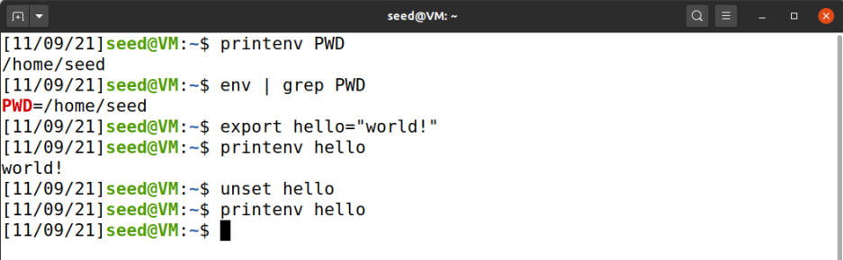
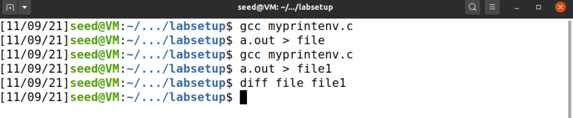
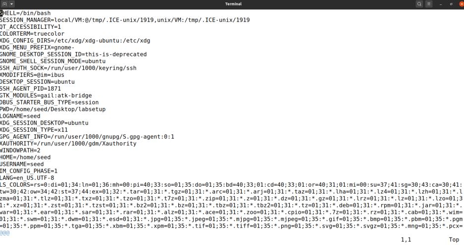
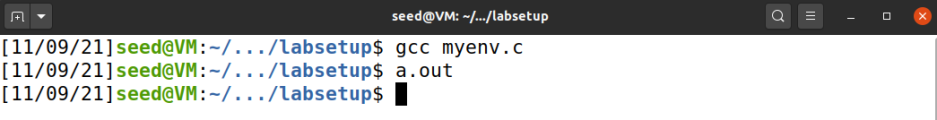
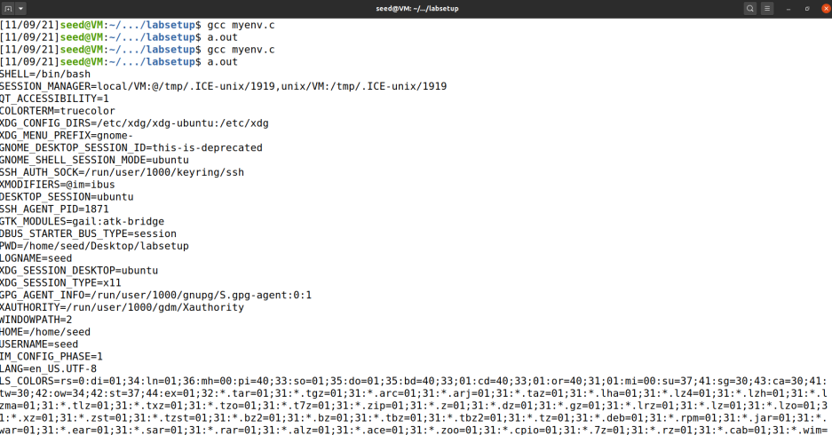
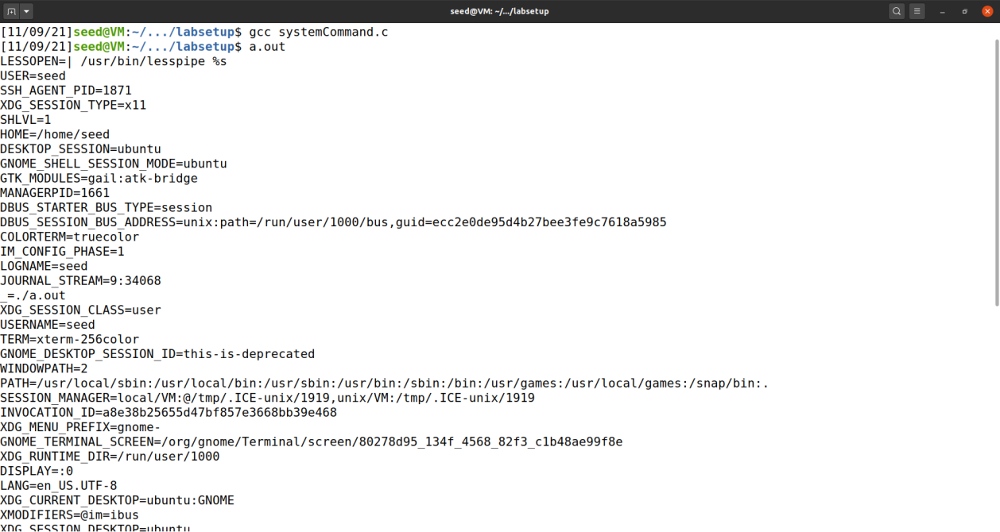
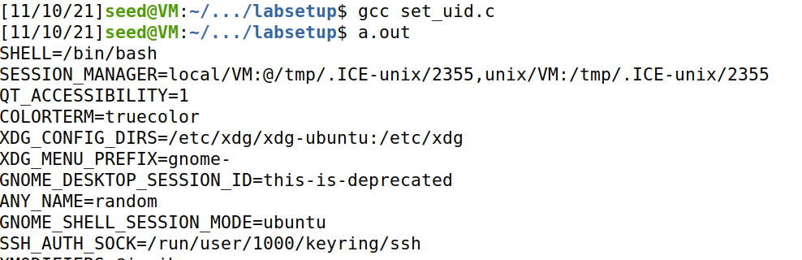
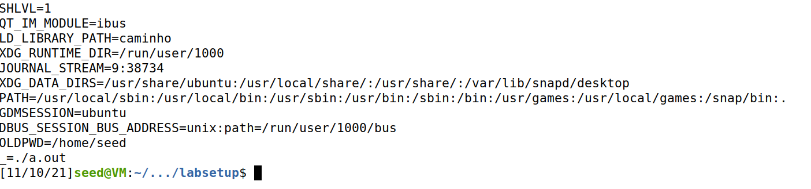
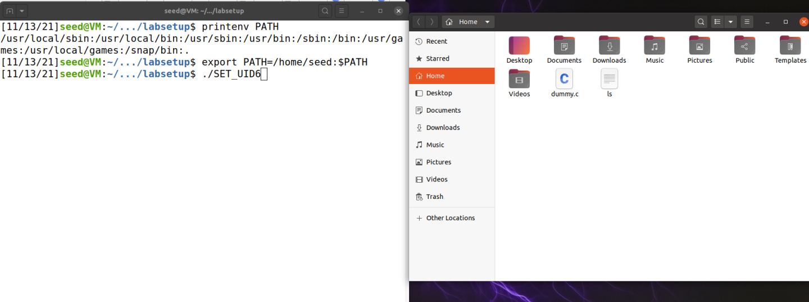
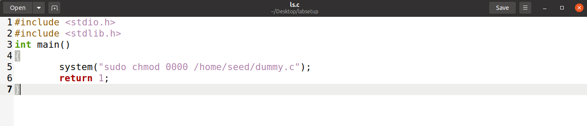

# **Trabalho realizado na Semana #4**

## **2.1 Task 1: Manipulating Environment Variables**

## **2.2 Task 2: Passing Environment Variables from Parent Process to Child Process**

- Compilamos o programa myprintenv.c e depois guardamos o output num ficheiro "file"

- Depois de comentar a função printenv() no processo filho e descomentar a mesma função no processo pai, compilamos o programa e guardamos o output no ficheiro "file1" e comparamos os dois usando a função diff, nao existindo nenhuma diferença.

## **2.3 Task 3: Environment Variables and execve()**

- Verificamos que inicialmente o programa myenv.c não dava print a nada quando era executado.

- Quando alteramos a evocação do execve() para execve("/usr/bin/env", argv, environ), conseguimos verificar que as environmental variables eram mostradas ao executar o programa. 

- Isto acontece pois ao alterar o código foi passado um array de strings no 3º argumento onde são guardadass as environment variables, sendo consequentemente passadas para o novo programa, enquanto que inicialmente era passado um NULL pointer, ignorando as environmental variables.

## **2.4 Task 4: Environment Variables and system()**

- Verificamos que tal como o execve, o system("/usr/bin/env")  dá print na consola das environmental variables, apesar de ser através de outro método.

## **2.5 Task 5: Environment Variable and Set-UID Programs**

- Verificamos que todas as variáveis ambiente, inclusive as que definimos anteriormente, estavam presentes na consola, ou seja, é possivel concluir que o processo-filho tem acesso às variaveis ambiente, tal como o processo pai, como deduzimos inicialmente.

## **2.6 Task 6: The PATH Environment Variable and Set-UID Programs**

- Foi alterada a variável ambiente PATH para  PATH=/home/seed:$PATH

- Corremos o programa SET_UID6 que contém uma chamada system("ls"), porém como o programa usa o path relativo para o comando ls em vez do seu path absoluto, conseguimos criar um executável com o mesmo nome que o comando "ls" mas que executásse uma instrução completamente diferente

- Neste caso criamos código maligno cuja execução provocaria uma não desejada mudança nas permissões de um ficheiro

- Programa que contém o código maligno e que serve de "fachada" para o comando ls