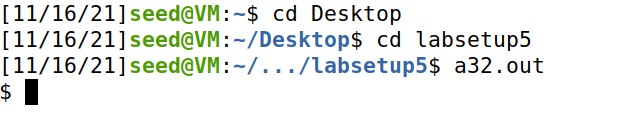
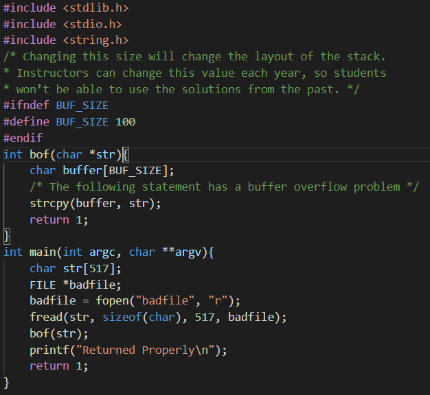
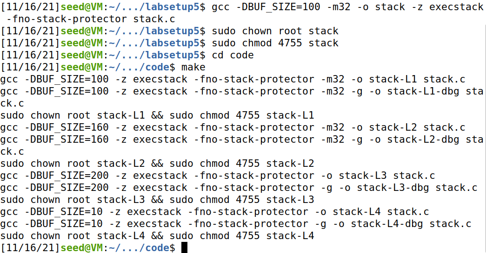
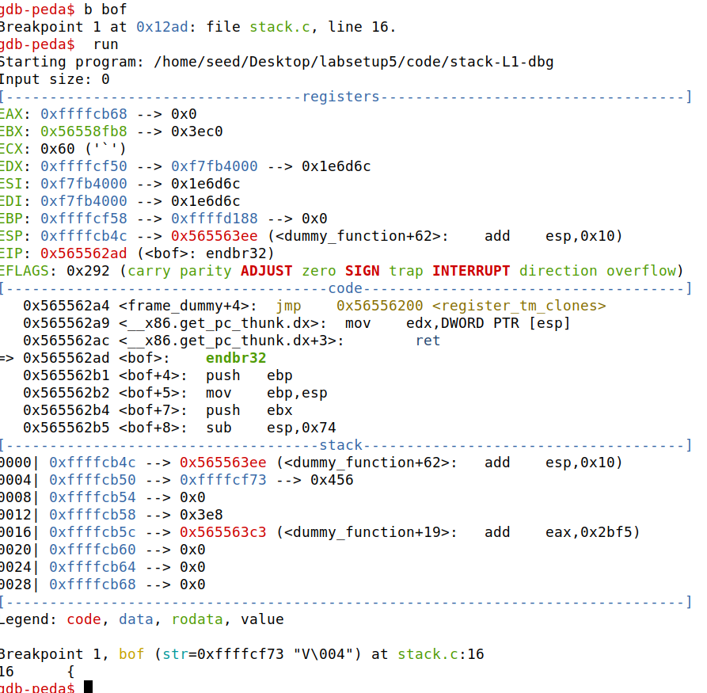
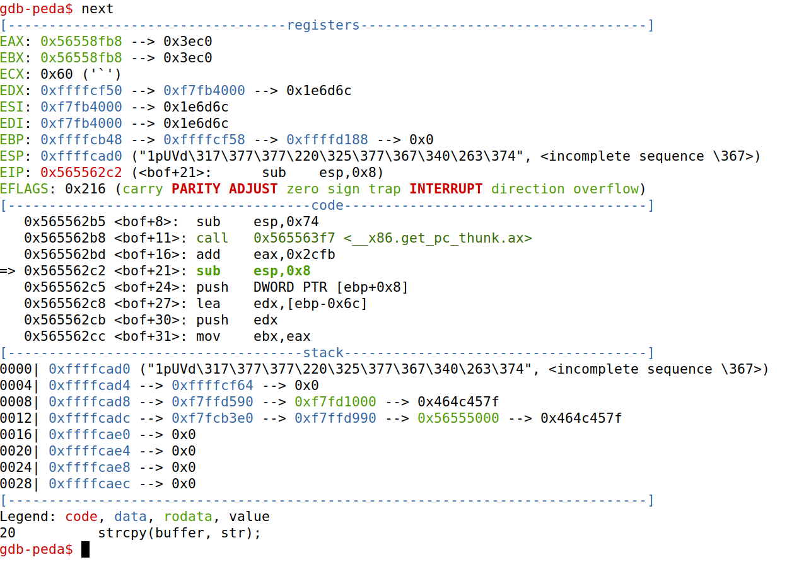
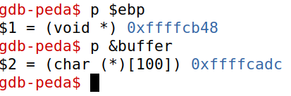
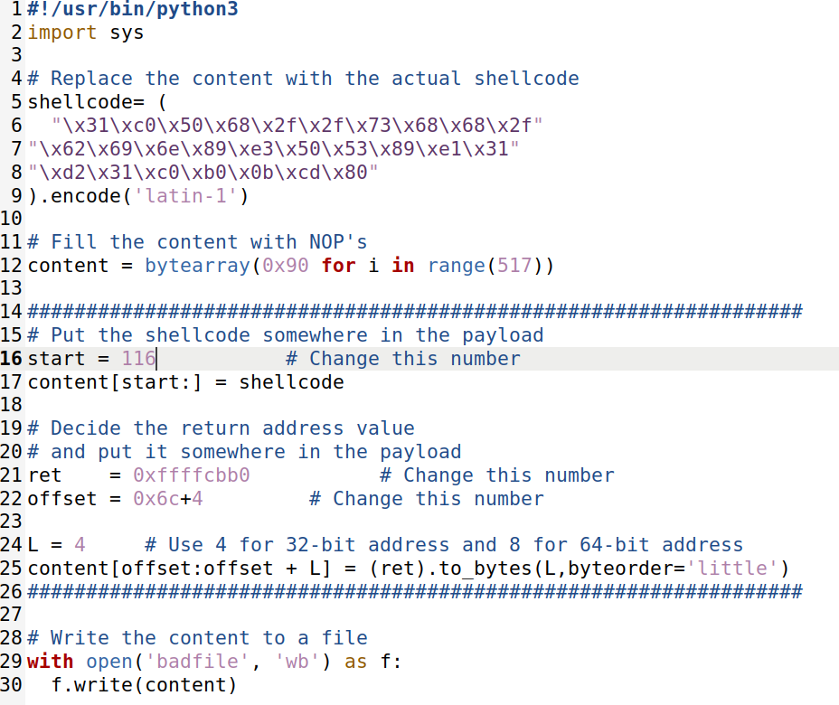
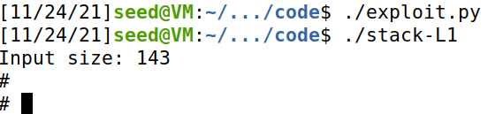

# **Trabalho realizado na Semana #5**

## **Task 1: Getting Familiar with Shellcode**

Para poder simular o ataque por buffer overflow, inicialmente foram desativadas algumas das proteções embutidas que o sistema operativo tem para se defender.

A melhor forma de correr shellcode é usando assembly. Após correr o script da shell, podemos confirmar o sucesso, dado que abriu sem erros com a indicação do símbolo '$'.

## **Task 2: Understanding the Vulnerable Program**

O problema que estamos a estudar aqui, a vulnerabilidade de buffer overflow, é uma das mais comuns no ramo. Isto acontece quando há um buffer limitado por determinado tamanho e o código escreve fora dos limites, por excesso de dados.

Neste caso, como é possível reparar, o buffer tem 100 bytes de tamanho. Como estamos a ler 517 bytes e a copiá-los sem restrições, é lógico que vamos exceder a memória do buffer, provocando overflow. Assim, vai-nos ser possivel chamar instruções arbitrárias.

Porém, para efetuar este tipo de operações é necessário ter acessos de execução, outrora é nos impedido que chamemos os scripts.

## **Task 3: Launching Attack on 32-bit Program (Level 1)**

Uma das coisas mais importantes a fazer ao explorar este tipo de ataque, é saber exatamente onde e como podemos efetivamente por o nosso código. Desse modo, usando o gdb para debug, conseguimos saber a posição na memória do buffer e do ebp.

Com esta informação, tudo o que falta é calcular as posições de memória onde queremos os nosso código a correr e suas implicações.

Sabendo que o buffer ocupa 0x6c(108) bytes até ao fim, no ebp, a posição do return value fica então imediatamente a seguir ao apontador, 4 posições, visto que estamos a trabalhar num sistema de 32bits. O offset é então 0x6c + 4, distância desde o começo do buffer.
Como é neste espaço de memória que o buffer acaba, podemos então começar a chamar o resto do código. No caso, o nosso shellcode tanto pode começar na posição seguinte ao return, como no último espaço possível dentro dos 517 bytes do ficheiro Badfile. Este espaço tem então uma amplitude de 116 até (517 - tamanho do shellcode).

Tendo atenção a todas as particularidades explicadas anteriormente, conseguimos então correr o script e aceder ao ficheiro com acesso total.