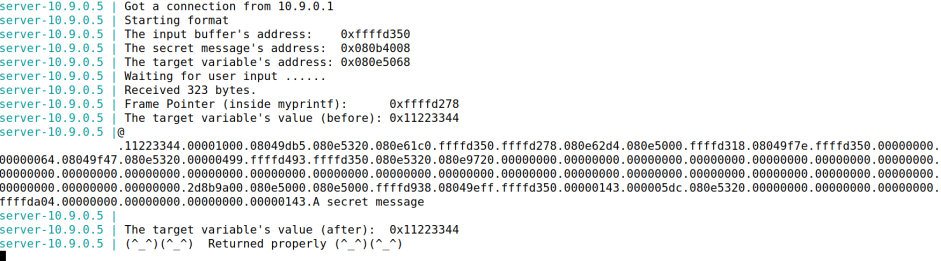

# **Trabalho realizado na Semana #6**

## **Task 1: Crashing the Program**

Para conseguirmos que o programa dê crash fornecemos ao server o input de uma string arbitrária para o server program tentar dar print à mesma (utilizando a função myprintf()), string esta que se encontra no ficheiro badfile.

Após corrermos o programa, como podemos concluir pela imagem, o mesmo crashou pois não foi retornada a string "Returned properly" devido a ter sido excedido o número total de bytes que a função printf() consegue detetar (ultrapassados os 1500 bytes disponíveis).

## **Task 2: Printing Out the Server Program’s Memory**

### **Task 2.A: Stack Data**

Nesta task inserimos o nosso input '<<<<' e uma série de '%.8x.' seguidos.

Depois demos print à memória da Stack e procuramos o nosso input cujo valor hexadecimal é igual a 3c3c3c3c.

Verificamos que na posição 64 da memória da stack encontramos o nosso input o que significa que o conseguimos ler na stack com sucesso.

Concluímos então que precisamos de 64 format specifiers para darmos print aos 4 primeiros bytes do nosso input.

### **Task 2.B: Heap Data**

Damos como input o endereço onde se encontra a secret message.

Depois usamos o "%s" na posição 64 para que o programa aceda e leia a memória guardada nesse endereço e dê print na consola à informação guardada.

Mensagem secreta que estava guardada no endereço:

## **Task 3: Modifying the Server Program’s Memory**

### **Task 3.A: Change the value to a different value**

Input utilizado:

À semelhança do que foi realizado na task anterior damos como input o endereço da target variable e usamos o "%n" na posição 64 para alteramos o valor dessa variável para um valor diferente.

### **Task 3.B: Change the value to 0x5000.**

Input:

Semelhante à alinea anterior, utilizamos o "%n", porém tivemos que inserir uns adicionais 19980 bytes para chegar ao valor desejado de 20480 bytes (20480 chars), de modo a que o "%n" coloque na variável guardada no endereço, que passamos, o valor 0x5000

