# **Trabalho realizado na Semana #8 e #9**

## **3 Lab Tasks**

## **3.1 Task 1: Get Familiar with SQL Statements**

Primeiro demos login na consola do MySQL e alteramos a database em uso para a Users.

Ao utilizarmos o comando show tables verificamos que apenas temos uma única tabela que é credential.

Para conseguirmos obter as credentials da Alice apenas executamos um comando SQL simples (SELECT * FROM credential WHERE name = "Alice").

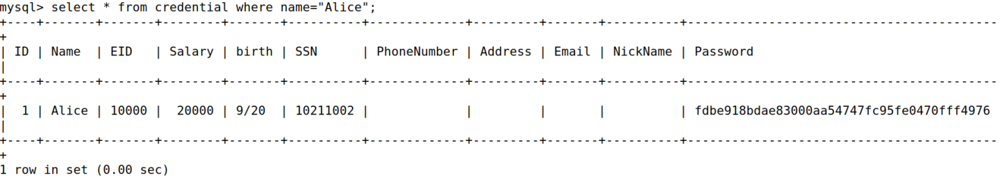

## **3.2 Task 2: SQL Injection Attack on SELECT Statement**

### **Task 2.1: SQL Injection Attack from webpage.**

Para conseguirmos dar login como administrador, tivemos que inserir no username "admin'#" pois o sinal '#' faz tudo depois de admin estar comentado no SQL deixando de ser verificada a password na querie.

Introduzimos uma password pelo simples facto do JavaScript conseguir verificar se um dado campo de input foi preenchido ou não.

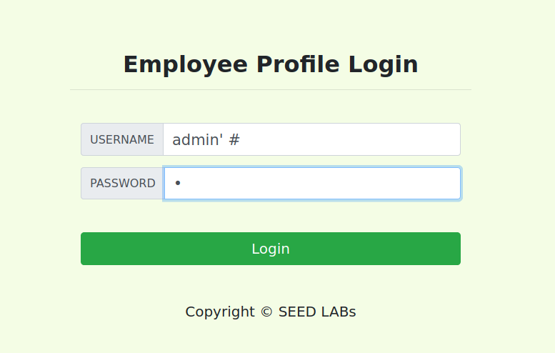

Após fazermos estes dois passos e termos dado login conseguimos obter as informações dos trabalhadores utilizando o ID do admin.

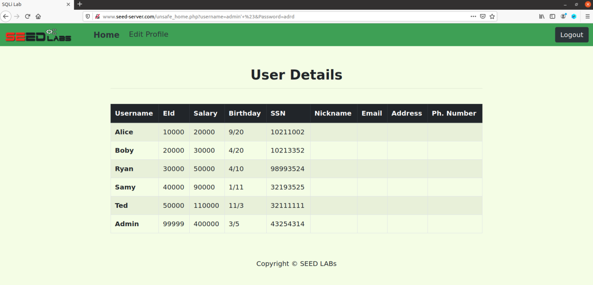

### **Task 2.2: SQL Injection Attack from command line.**

Utilizamos o comando curl para fazer um pedido HTTP ao website de forma a fazer novamente o login e alteramos os carateres 'espaço', 'hashtag' e 'single quote' para o seu código ascii correspondente.

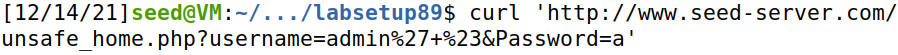

Após corrermos este comando obtivemos como resposta a página HTML, onde podemos ver as informações dos trabalhadores.

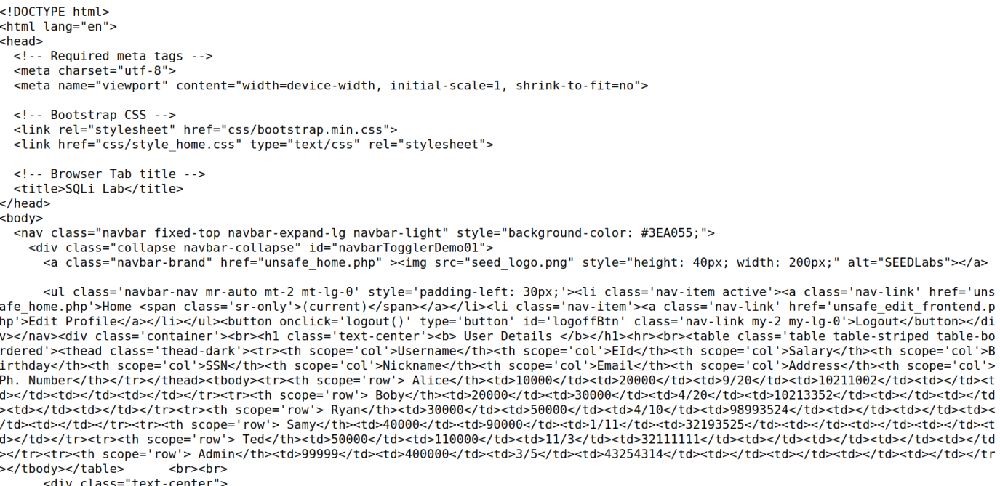

### **Task 2.3: Append a new SQL statement.**

Para conseguirmos dar append a um novo statement de SQL, introduzimos como USERNAME o seguinte:

query: admin'; UPDATE credential SET Name = 'FSI' WHERE Name = 'Ted'; #

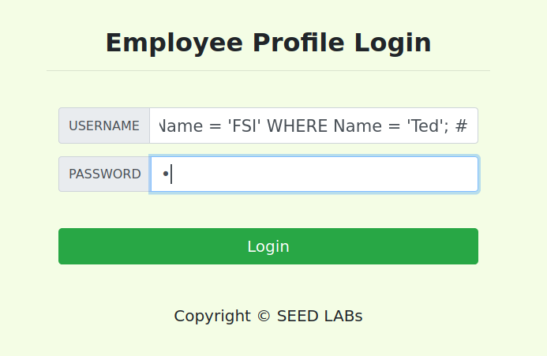

Utilizamos o ';' para separar os dois statements de SQL. No segundo statement tentamos alterar o nome do trabalhador 'Ted' para 'FSI'

Porém, ao tentarmos realizar o login pudemos ver que este não foi realizado com sucesso e não foi acrescentado um segundo comando SQL aparecendo o seguinte erro:

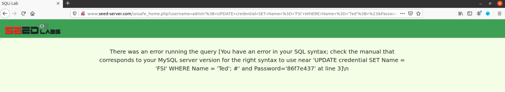

Esta tentativa de realizar um 'SQL injection' não funcionou contra o MySQL pois a extensão do PHP não permite a execução de múltiplas queries no servidor da base de dados.

## **3.3 Task 3: SQL Injection Attack on UPDATE Statement**
 
### **Task 3.1: Modify your own salary.**
Para conseguirmos alterar o salário da 'Alice', demos login na conta da 'Alice' e introduzimos a seguinte informação:

query: 987654321', salary = 9999999 WHERE name='Alice' #

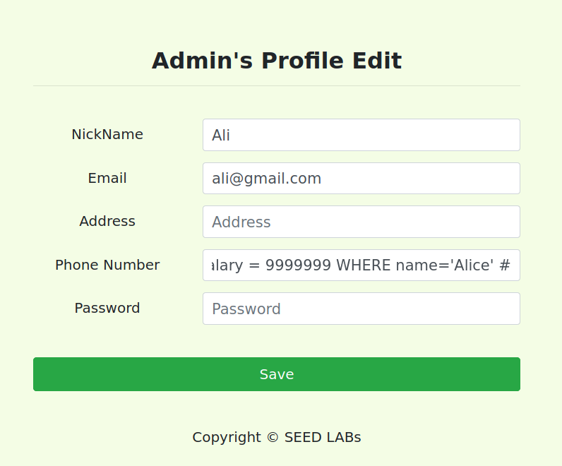

Ao verificarmos o perfil dos vários trabalhadores depois de termos dado login pudemos confirmar que de facto conseguimos alterar com sucesso o salário da 'Alice'.

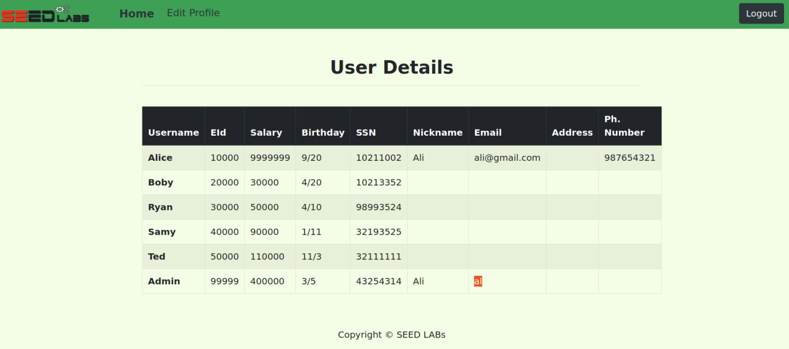

### **Task 3.2: Modify other people’ salary.**

Para conseguirmos alterar o salário do 'Boby' introduzimos a seguinte informação na caixa de input do número de telefone:

123456789', salary=1 WHERE name='Boby' #

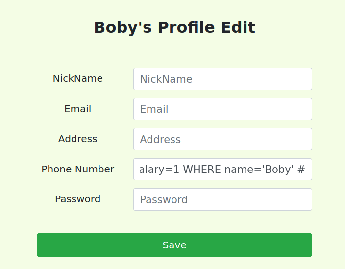

Podemos então confirmar que, de facto, conseguimos alterar o valor do salário do 'Boby' para 1.

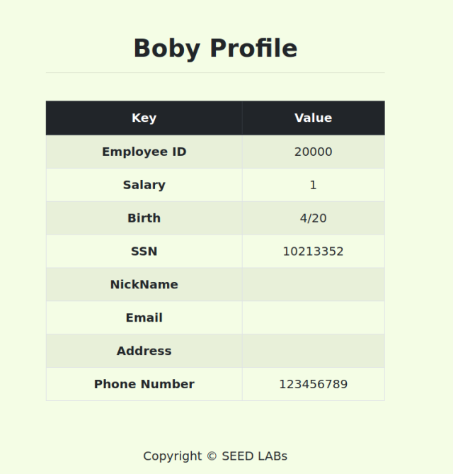

Concluímos também que poderíamos ter colocado a informação em qualquer uma das outras caixas de input à exceção da password pois está hashed.